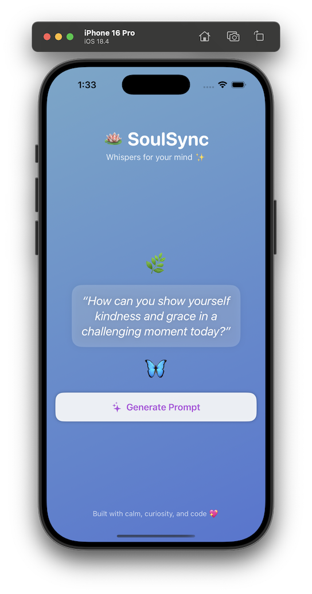

🪷 SoulSync – A Serene AI-Powered Journaling Prompt App
SoulSync is a calming journaling companion powered by GPT and crafted with SwiftUI. It generates peaceful daily prompts to inspire self-reflection — one mindful moment at a time.

🌟 Features
✨ Beautiful animated gradient background

🪷 Clean SwiftUI interface with MVVM structure

🧠 Thoughtful AI-generated journaling prompts

🌀 Async/await-powered GPT integration (via OpenAI API)

📱 Fully self-contained Swift project — easy to build and extend

🔧 Tech Stack
Swift & SwiftUI

MVVM Architecture

GPT-3.5 via OpenAI API

Async/Await networking

🛠 Setup & API Key
Clone the repository

Create a Secrets.xcconfig file in the root directory:

swift
Copy
Edit
OPENAI_API_KEY = your_key_here
OPENAI_API_URL = https://api.openai.com/v1/chat/completions
Make sure .xcconfig is linked in Build Settings > Configurations

Run the app on Simulator or device

⚠️ Your API key is required and not included in the repo for security.

🚧 Upcoming Features
📝 Save and view journaling history

📊 Mood + focus tracker

🌙 Custom dark/light mode options

🧘🏽‍♀️ Daily reminder integration

📸 Preview

💡 Why SoulSync?
Sometimes all it takes is one good question to unlock clarity.
SoulSync offers that — in a minimal, peaceful, and beautifully coded experience.

🧘🏽‍♀️ Built with serenity by Ruchika Bokadia
